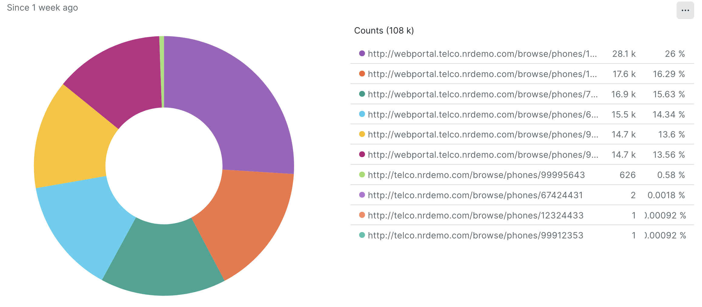
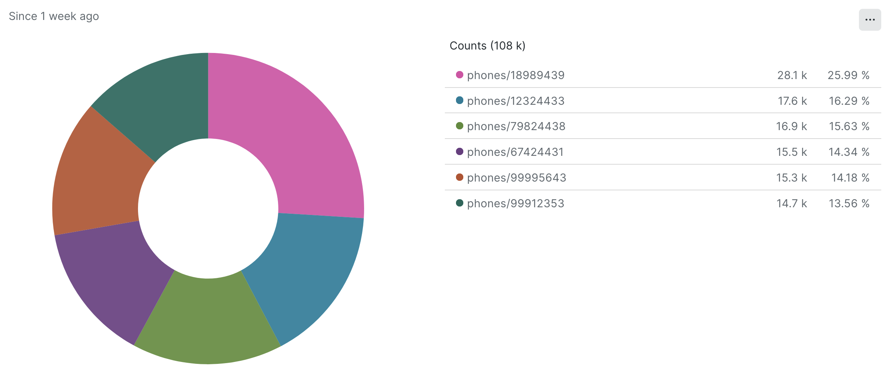
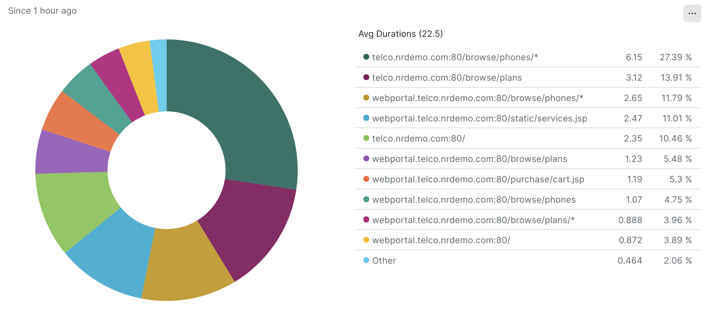
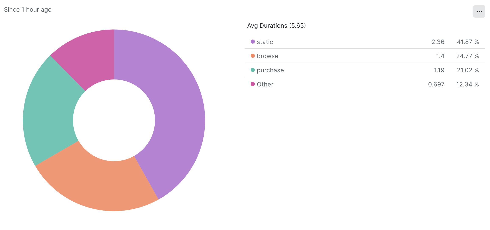
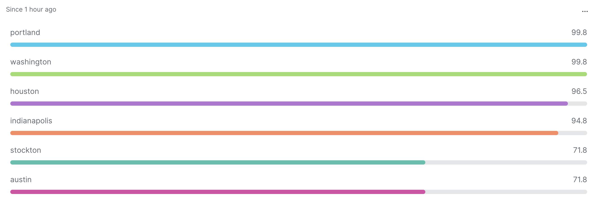
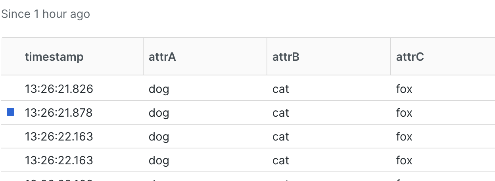
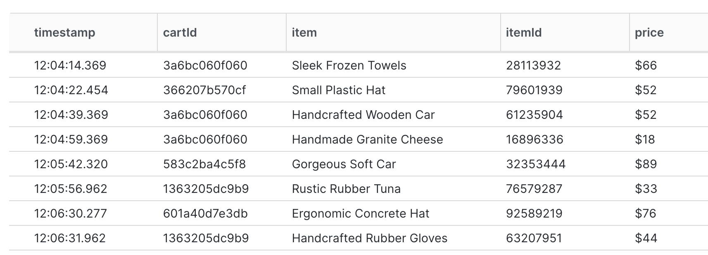
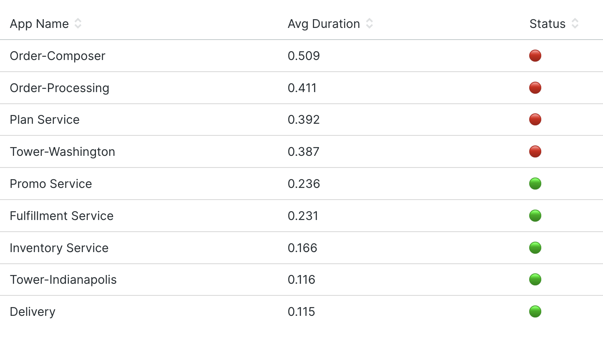

# Lab 01: Improve dashboard usability with data manipulation
This lab explores how you can use **anchor parse** [`aparse()`](https://docs.newrelic.com/docs/query-your-data/nrql-new-relic-query-language/get-started/nrql-syntax-clauses-functions/#func-aparse) and capure [`capture()`](https://docs.newrelic.com/docs/query-your-data/nrql-new-relic-query-language/get-started/nrql-syntax-clauses-functions/#func-capture) amongst other features to manipulate your data to make the data on your dashboards easier to use and understand.

## Pre-requisites
To complete this lab you need access to the Demotron v2 account in New Relic. This can be accessed via your NRU learning account.

## About the challenges
There are eight challenges to complete as part of this lab. Solutions can be found [here](./solution.md). If you get stuck consult the [documentation](https://docs.newrelic.com/docs/query-your-data/nrql-new-relic-query-language/get-started/nrql-syntax-clauses-functions/#func-aparse) before peeking at the solution!

## Your data, your way
New Relic allows you to ingest all sorts of structured and unstructured data. You don't always know how you might use the data you are sending or you may not have control over the format that the data is sent. In either case there are times when you need to manipulate the data at query time to make it easier to use and understand.

Lets looks at an example. Consider you have a page in your application that includes the product name or ID of a product. e.g.`/browser/phones/1234`. You want to show a pie chart showing the most commonly viewed products so you write an NRQL query that counts by product:

```
select count(*) from PageView where pageUrl like '%phones/%' facet pageUrl WHERE appName='WebPortal' since 1 week ago limit 20
```


This pie chart shows the data, but the data in the facet we're displaying (`pageUrl`) is very long and in fact the product ID is often clipped. This makes it hard to read, especially at a glance. See how much easier the following version of the same data is to read with the domain name removed. We can focus on the details and there is no data clipping:



Choosing precisely what data is displayed can significantly help understand data quickly and accurately. 

## Using anchor parse for selecting data
The anchor parse (`aparse()`) function is our go-to function to help with this sort of task. It takes two parameters: 

`aparse(attribute, pattern)`

1. The attribute to perform the parse on
2. The pattern to use 

The pattern is where the magic happens. It helps you define what to keep and what to throw away from a string. The pattern can contain two special characters `%` and `*`.  Both of these are 'wildcards'. A 'wildcard' match means it matches any and all characters. 

- One, `%`,  is used to match any and all characters to **discard** (don't show)
- One, `*`,  is used to match any and all characters to **capture** (show)

This is best shown by example! Consider this pageUrl: `http://webportal.telco.nrdemo.com/browse/phones/99912353`. In this example we want to discard the domain name leaving just the product type and number `/phones/99912353`. How do we do that?

```
Page URL: http://webportal.telco.nrdemo.com/browse/phones/99912353
Pattern : http://webportal.telco.nrdemo.com/browse*
```

You can see this in action here on Demotron:
```
SELECT aparse(pageUrl,'http://webportal.telco.nrdemo.com/browse*') as product FROM PageView WHERE pageUrl LIKE '%phones/%' AND appName='WebPortal'
```

This matches, and **captures** everything after `.../browse`. That's what the `*` does. This works if all the first part of your url's all exactly match: "http://webportal.telco.nrdemo.com/browse/". But if you look hard in the data you'll notice we have some pageUrl's that don't start with "http://webportal...", they have an empty 'product' column because the pattern didn't match

Don't believe us? Try this query:
```
SELECT aparse(pageUrl,'http://webportal.telco.nrdemo.com/browse*') as product, pageUrl FROM PageView WHERE pageUrl like '%phones/%' AND appName='WebPortal' AND pageUrl NOT LIKE 'http://webportal%'
```

This is a common problem with patterns, they are too restrictive. We need to add some flexibility to our pattern, and that's where `%` comes in. It lets us match a sequence of characters but doesn't capture it. Here is a better pattern:

```
Page URL: http://webportal.telco.nrdemo.com/browse/phones/99912353
Pattern : %/browse/*
```

### ✏️ Challenge #1:
Update the pattern in this query to correctly capture the product from all urls whether or not they start with "http://webportal.." or "http://telco.nrdemo..."

```
select aparse(pageUrl,'PATTERN-HERE') as product, pageUrl from PageView where pageUrl like '%phones/%' WHERE appName='WebPortal' 
```


[[-Solution-]](./solution.md#challenge-1)

## Grouping data with aparse() and facets
Now you know the basics of aparse() we can use it to explore some further use cases. One very common dashboarding technique is to group data by a facet. This lets you see how different groupings affect a metric you're interested in. 

Take the following query as an example, which groups the browser transactions by name and displays the average duration. 

```
FROM PageView SELECT average(duration) FACET browserTransactionName WHERE appName='WebPortal'
```



This is rather messy as it mixes domains, folders and specific pages. Often when looking at data we are interested in grouping similar pages together, for instance in this example by url segment: '**static**', '**browse**', '**purchase**', etc. We can use `aparse()` in the facet part of the query do this.


### ✏️ Challenge #2:
Using what you know about aparse() can you update the query below to group them so we just aggregate the static, purchase, browse segments? 

> Hint: Its possible to use more than one `%` wild card character! 

```
FROM PageView SELECT average(duration) FACET aparse(browserTransactionName,'YOUR-PATTERN-HERE') AS group WHERE appName='WebPortal'
```

The output should look something like this:



[[-Solution-]](./solution.md#challenge-2)


## Pre-processing the data with variables
In the previous example we used `aparse()` in the facet part of the NRQL query to manipulate the data. This is fine but there is another place we can do this that might be neater and is a great way to introduce variables that we'll need later

Variables can be defined using the `WITH` clause in your NRQL. The basic syntax is changed as follows:
```
Previous  : FROM x SELECT ... FACET fn(y) AS z ...
Using WITH: FROM x WITH fn(y) AS z SELECT ... FACET z ...
``` 
> `fn()` is any supported function, `aparse()` for instance!
> In this case the variable 'z' contains the value after the function `fn()` has run on it.

### ✏️ Challenge #3:
Change your query from challenge #2 so that the `aparse()` is performed in the `WITH` clause rather than directly in the `FACET` clause. Use the basic syntax above to work out how to move things around.

```
FROM PageView WITH ____ AS ____ SELECT average(duration) FACET group WHERE appName='WebPortal'
```
> Hint: The `AS` is important here because it labels the value to be used in the facet clause.

[[-Solution-]](./solution.md#challenge-3)

### ✏️ Challenge #4:
Consider another data set of hostnames and CPU provided by this query:

```
FROM SystemSample SELECT average(cpuPercent) FACET hostname where hostname like '%tower%'
```

The host names in the data appear like this: `'host-tower-washington'`. 

Can you construct a query using aparse to display a simpler list of hostnames with just the location name instead of host name,  e.g. `'washington'`? Try to construct both the variants discussed above, one with the `aparse()` in the `FACET` clause and the other using `WITH` variables.

```
Variant 1 : FROM x SELECT ... FACET fn(y) AS z ...
Variant 2 : FROM x WITH fn(y) AS z SELECT ... FACET z ...
``` 

The output should look something like this:


[[-Solution-]](./solution.md#challenge-4)

## Extract data for evaluation
Let's change gears now and look at another common use case: extracting values from the data. Sometimes the data in a column contains multiple useful values that we would like to perform analysis on. This is especially true for unstructured logs. Whilst we can apply parsing rules to logs as they are ingested we can also parse them when we query them with, among other things, aparse().


In the Demotron V2 account there is Log data being ingested with interesting data in the message column. You can view this yourself with this query:
```
FROM Log SELECT message WHERE message LIKE 'ADD to cart:%'
```

Here is an example record:
```
ADD to cart: http://addtocart/35e80ca05773/item" body: {"item":"Cheese","itemId":"77697861","unitPrice":"$14.00"}
```

You can see within this text string there is lots of buried information. There is what looks like a cart ID in that URL (`35e80ca05773`), an item name, itemId and a unitPrice field. This looks like its logging the addition of items to a shopping cart - that's really useful business data if we could access it!

### ✏️ Challenge #5
To give us a good feel for how much business our online shop is doing it would be great to know how many unique carts (i.e. customers) there are at any given time. Write a pattern to capture the cartID from the URL in the log message and count how many unique carts there have been over the last hour.  Here is a query to use as a starting point:

```
FROM Log WITH aparse(message,'YOUR-PATTERN-HERE') AS cartId SELECT uniqueCount(cartId) WHERE message like 'ADD to cart:%' 
```

[[-Solution-]](./solution.md#challenge-5)

## Multiple captures
So far we've used anchor parse to capture single values from our data, like the Cart Id in the previous challenge. Anchor parse actually allows us to capture multiple values at once which can help us to extract the other values from our example logs line all in one go. For this we need to tweak our syntax slightly so that we can name our attributes, the general format is:

```
aparse(string, pattern) AS (attribute1, attribute2, attribute3,...)
```

Each `*` in the pattern will relate to an attribute in the AS clause.

For example for the log line with message attribute value `four legged animals {"a":"dog", "b":"cat", "c":"fox"}` we can extract each of these three values into separate columns with this pattern like this:

```
FROM Log WITH aparse(message,'%{"a":"*", "b":"*", "c":"*"}') AS (attrA,attrB,attrC) select attrA,attrB,attrC LIMIT 10
```



### ✏️ Challenge #6
Write a query that extracts and displays the cartId, the item name, id and price in their own columns all within one aparse(). Here is a template query for you to amend:

```
FROM Log WITH aparse(message,'YOUR-PATTERN_HERE') AS your-as-clause-here SELECT cartId, item, itemId, price WHERE message like 'ADD to cart:%'
```

The output should look a bit like this:


[[-Solution-]](./solution.md#challenge-6)

### ✏️ Challenge #7
What is the most popular product added to the carts? Adjust your query from challenge #6 to list products by popularity.

> Hint: Count the number of items with the same name

[[-Solution-]](./solution.md#challenge-7)

## Mathematical analysis on extracted values
Now you know how to extract the values from the data we can now use those values to surface some business information. For instance how many items are in each basket? We can determine that with a faceted count()

```
FROM Log WITH aparse(message,'%addtocart/*/%item":"*"%itemId":"*"%unitPrice":*}') as (cartId, item, itemId, price) SELECT count(*) as numItems facet cartId WHERE message like 'ADD to cart:%' limit max 
```

We could also determine the average number of items in all our carts using a bit of [nested aggregation](https://docs.newrelic.com/docs/query-your-data/nrql-new-relic-query-language/nrql-query-tutorials/nested-aggregation-make-ordered-computations-single-query/):

```
SELECT average(numItems) AS avgCartSize FROM ( FROM Log WITH aparse(message,'%addtocart/*/%item":"*"%itemId":"*"%unitPrice":*}') as (cartId, item, itemId, price) SELECT count(*) as numItems facet cartId WHERE message like 'ADD to cart:%' limit max) 
```

### ✏️ Challenge #8
A common business metric that is relevant to e-commerce is the average value of the items in customers carts. 
Can you write an NRQL query that displays the average cart value?

> Hint: That `$` sign in the price might be a problem. How might you remove that?

>Hint: The [average()](https://docs.newrelic.com/docs/query-your-data/nrql-new-relic-query-language/get-started/nrql-syntax-clauses-functions/#func-average) function requires a numerical input. You can cast a string to a number using the `numeric()` function. e.g. `numeric('123')`

[[-Solution-]](./solution.md#challenge-8)


## Conditional logic for clarity and embellishment
Before we change up a gear and move onto the final part of the lab, lets take a brief foray to look at another super simple but really effective technique for manipulating the data that can really supercharge your dashboards. This is so useful I couldn't not include it!

One technique for making data more understandable at glance is to change its colour based on the value. You may already do this using the billboard widget which allows you to set a threshold for warning and critical which changes the colour of the widget. Howver its a touch limited and doesn't work with other widget types.

The `IF` clause allows us to replicate this functionality to some extent allowing us to display a value of our choice based on the calculated values. 

The IF syntax is simple: ```IF(condition,true,false)```

Here's an example, we simply display a green or red emoji character based upon the value:

```
FROM Transaction SELECT average(duration), IF(average(duration) < 0.3,'🟢','🔴') AS 'Status' FACET appName 
```

You can see how immediately powerful and easy to understand at a glance this is:


### ✏️ Challenge #9
Its time to up your emoji game! `IF` statements can be nested, this means you can display more than two options. Refactor the query above so that it displays three different indicators: good, warning, critical. You can use any string or emoji character you like. Decide your own thresholds.

```
FROM Transaction SELECT average(duration), IF( ____ ) AS 'Status' FACET appName 
```

> Hint: You can nest `IF` like this: `IF(condition,IF(condition,true,false),false)`

> Hint: Not sure how to find emoji's? On a Mac use the [Emoji and Symbols viewer](https://support.apple.com/en-gb/guide/mac-help/mchlp1560/mac)

[[-Solution-]](./solution.md#challenge-9)

## More complex pattern matching
We've been using anchor parse to search and extract the data values we want. But sometimes the data is more complicated and requires a more powerful pattern match. The [`capture()`](https://docs.newrelic.com/docs/query-your-data/nrql-new-relic-query-language/get-started/nrql-syntax-clauses-functions/#func-capture) function in NRQL performs a similar function to `aparse()` but instead of `*` and `%` characters for matching it supports full regular expression matching.

People have written books on regular expressions, so we'll not go into too much detail. But you can convert an aparse() to a capture() like this:

Let's revisit a pattern we explored earlier:

```
WITH aparse('a=dog b=cat c=fox', 'a=* b=* c=*') AS (attrA,attrB,attrC)
```

The capture equivalent of this is:

```
FROM Log WITH  capture('a=dog b=cat c=fox', r'a=(?<attrA>.*?)=(?<attrB>.*?)=(?<attrC>.*?)')  select attrA,attrB,attrC,message LIMIT 10
```

The main difference here is that rather than naming our captured groups in the AS clause they are named within the pttern itself. The general pattern for this is `(?<columnName>(.*?))` which in this case captures all characters (`.*?`) and saves them to a column called "columnName".


### ✏️ Bonus Challenge #10
This challenge is tricky but will help you understand why anchor parse is so much easier to use! Whilst anchor parse is simpler, capture() may well be necessary for more complicated data extractions.

Look back at your solution to Challenge 5. Can you rewrite this to use capture() instead of aparse()?

> Hint: A `*` wildcard can generally be replaced by a capture group `(?P<attrName>.*)` 
> Hint: A `%` wildcard can generally be replaced with `.*`
> Hint: Don't get stuck on this challenge too long! If you are stuck consult the solution to understand how to approach the answer.

[[-Solution-]](./solution.md#challenge-10)

## Conclusion
In this lab you have learnt to use anchor parse to extract useful values from your data. You can now build dashboards that are easier to read, understand and use. You can also now interrogate unstructured data for business intelligence. 
