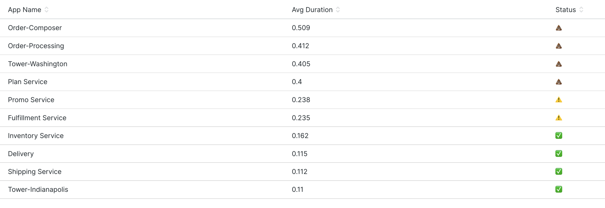

# Lab 01: Solutions
Here you can find all the solutions to the challenges in Lab 01. You can also find these on [this dashboard.](https://onenr.io/0dQeLKPJWje)

### Challenge #1
Your query should look something like this:
```
select aparse(pageUrl,'%/browse*') as product, pageUrl from PageView where pageUrl like '%phones/%' WHERE appName='WebPortal' 
```

You can verify that both domains return data for the product column:
```
select aparse(pageUrl,'%/browse*') as product, pageUrl from PageView where pageUrl like '%phones/%' WHERE appName='WebPortal' and pageUrl not like 'http://webportal%' 
```


### Challenge #2
There are a number of solutions to this problem. This one of the shortest patterns you could use: `'%/*/%'`

This uses to `%` wildcards to match (and discard) everything up until the first `/`, then capture everything until the next `/` (with `*`) and then discards the rest (the seconds `%`):

```
FROM PageView SELECT average(duration) FACET aparse(browserTransactionName,'%/*/%') as group WHERE appName='WebPortal'
```

### Challenge #3
The solution to this challenge just requires you to move the aparse() and add the WITH keyword. We are indicating that the *aparsed* version of browserTransactionName will become available in the variable named 'group' and we then facet on that.

```
FROM PageView WITH aparse(browserTransactionName,'%/*/%') AS group SELECT average(duration) FACET group WHERE appName='WebPortal'
```

### Challenege #4
There are a number of patterns you could use here with increasing flexibility:
- `'host-tower-*'`
- `'%-tower-*'`
- `'%-%-*'`

**FACET version:**
```
FROM SystemSample SELECT average(cpuPercent) FACET aparse(hostname, '%-%-*') AS group where hostname like '%tower%'
```

**WITH variables version:**
```
FROM SystemSample WITH aparse(hostname, '%-%-*') AS group SELECT average(cpuPercent) FACET group where hostname like '%tower%'
```

### Challenge #5
To extract the cart ID from the data we need a pattern that understand the URL format, this pattern does the job: `'%addtocart/*/%'. It captures everything after the 'addtocart/' tring up tuni lthe next '/'.

```
FROM Log WITH aparse(message,'%addtocart/*/%') AS cartId SELECT uniqueCount(cartId) WHERE message like 'ADD to cart:%'
```

### Challenge #6
Here is a solution to this challenge, yours may look a little different. In this case we carefully place the `*` to capture each of the values we require.

```
FROM Log WITH aparse(message,'%addtocart/*/%item":"*"%itemId":"*"%unitPrice":"*"}') AS (cartId, item, itemId, price) SELECT cartId, item, itemId, price  WHERE message like 'ADD to cart:%'
```

### Challenge #7
The solution to this challenge is to `count(*)` the results and facet by `item`.

```
FROM Log WITH aparse(message,'%addtocart/*/%item":"*"%itemId":"*"%unitPrice":"*"}') AS (cartId, item, itemId, price) SELECT count(*) facet item WHERE message like 'ADD to cart:%' 
```

### Challenge #8
In order to calculate an average value we need to convert the price to a number. To do that we need to remove the `$` sign. You can do that by updating the pattern so that the `$` is no longer captured as we have done here. Another alternative solution would be to use the [substring()](https://docs.newrelic.com/docs/query-your-data/nrql-new-relic-query-language/get-started/nrql-syntax-clauses-functions/#func-substring) function to remove it.

Once we have the price value isolated with no `$` sign we then need to cast it to a numeric. We simply wrpa the value in numeric(). Notice how we sum() the prices together for each cart then use nested aggregation to determine the average.

A solution adjusting the pattern to remove the `$`:
```
SELECT average(cartPrice) as avgCartPrice FROM ( FROM Log WITH aparse(message,'%addtocart/*/%item":"*"%itemId":"*"%unitPrice":"$*"}') as (cartId, item, itemId, price) SELECT sum(numeric(price)) as cartPrice facet cartId WHERE message like 'ADD to cart:%' limit max)
```

A solution using substring():
```
SELECT average(cartPrice) as avgCartPrice FROM ( FROM Log WITH aparse(message,'%addtocart/*/%item":"*"%itemId":"*"%unitPrice":"*"}') as (cartId, item, itemId, price) SELECT sum(numeric(substring(price,1))) as cartPrice facet cartId WHERE message like 'ADD to cart:%' limit max)
```

> Note: This works up to 2000 carts, after which the inner query will be limited. If you have data that is higher frequency than this then you should consider sending the basket size/value in as an atribute of the ingested data itself, movign the processing closer to the source.

### Challenge 9
Any opportunity to use the poo emoji shouldn't be wasted!:

```
FROM Transaction SELECT average(duration), IF(average(duration) < 0.2,'✅',IF(average(duration) < 0.3,'⚠️','💩') ) as Status FACET appName 
```



### Challenge 10
There are many ways to write the regular expression to capture the data. Here is one that works that is close in style to the anchor parse pattern:

```
FROM Log WITH capture(message,r'.*addtocart/(?P<cartId>.*)/.*item":"(?P<item>.+)".+itemId":"(?P<itemId>.*)".+unitPrice":"(?P<price>.*)".*') AS (cartId, item, itemId, price) SELECT cartId, item, itemId, price, message  WHERE message like 'ADD to cart:%'
```

