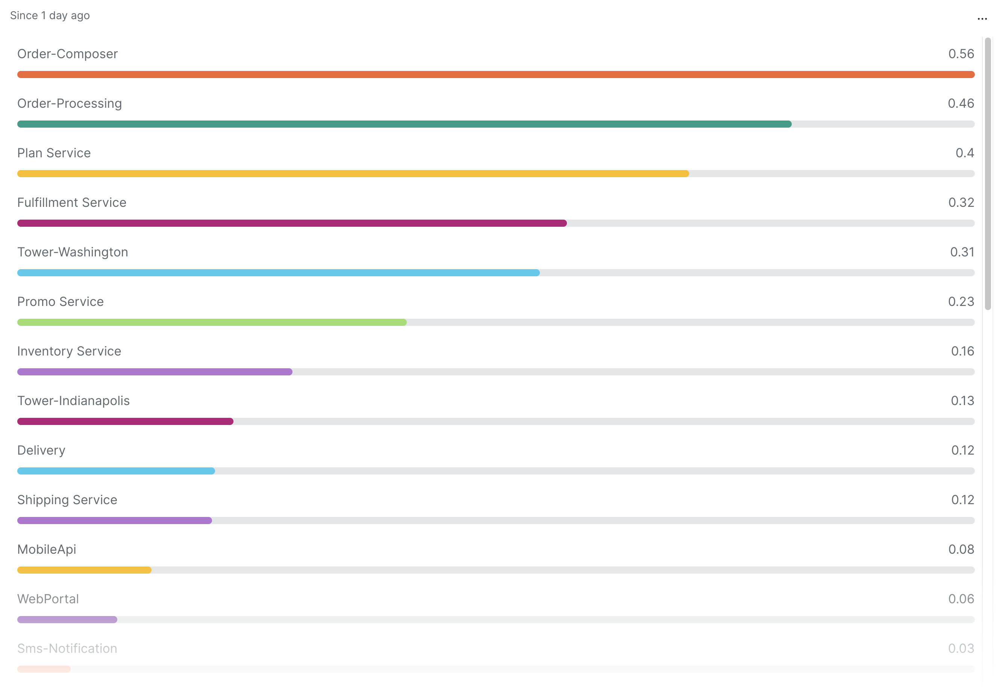
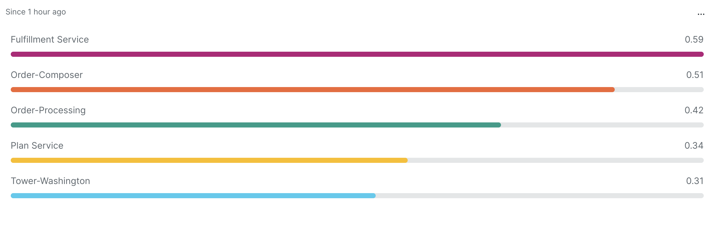
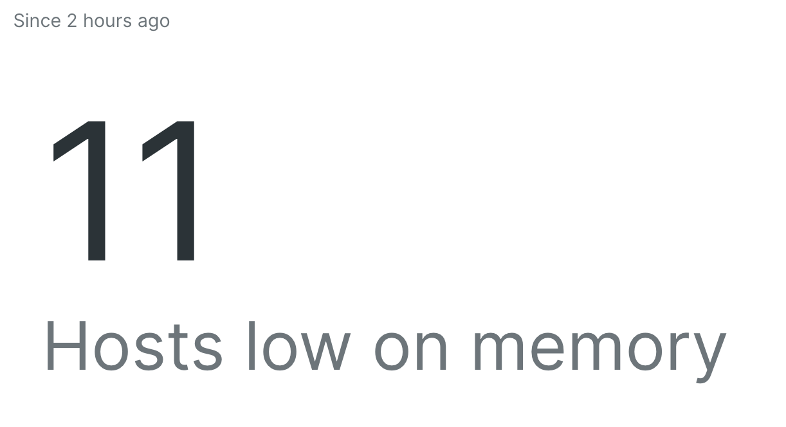
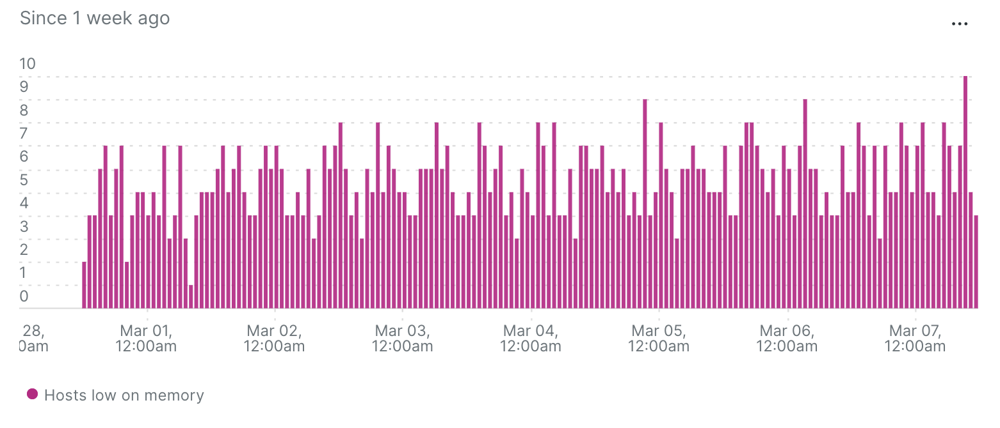

# Lab 02: Summarise and post process your results
This lab explores how you can can use nested aggregation to post process your query results to summarise them and make them more impactful and relevant.

## Pre-requisites
To complete this lab you need access to the Demotron v2 account in New Relic. This can be accessed via your NRU learning account.

## Introduction
Any given NRQL query returns a result set based upon the data available at query time. Whilst you can derive new values from the data using functions such as average(), count() and percentile() its only possible to filter on values already present in the data. You can not filter on these derived values.

At times its useful to reduce the data output of a query to make it more relevant and easier to understand. For instance rather than listing the averge load of 1000 hosts in a long table, you might want to list only those hosts you care about that have a load above a certain threshold. Or perhaps you just want to know how many hosts are above that threshold and are not interested in the details.

Making dashboards and data understandable *at a glance*, by reducing the cognitive effort to process them, is essential for effective and valuable dashboards.

[Nested aggregation](https://docs.newrelic.com/docs/query-your-data/nrql-new-relic-query-language/nrql-query-tutorials/nested-aggregation-make-ordered-computations-single-query/) is a feature that allows you to perfrom this sort of splice and dicing of the results.

## How to use nested aggregation
Consider this simple query that lists all the applications average response times:

```
FROM Transaction SELECT average(duration) AS avgDuration FACET appName LIMIT max SINCE 1 hour AGO
```
**Application response time:**


This is a long list of all the applications! If you wanted to quickly know what apps were slow then this would require some mental gymnastics and reading of the data to determine. Rather than show the whole list, what if instead we show a list of "Slow Apps"? This is a subtle difference in our definition but it infers that we now have a (predefined) threshold over which we consider an application is slow. If we can filter to applications that breach the threshold then, with lower cognitive effort, we can easily see the scale of the problem at a glance without having to read all the values in the table and derive the answer in our heads.

Nested aggregation allows us to preform this extra processing of our result data. The general format is quite straightforward, you wrap your original query in brackets and add an extra select outside. Here is the general pattern for nested aggregation:

```
SELECT function(attribute)      <- outer query
FROM (
  SELECT function(attribute)    <- inner query
  FROM dataType
  WHERE attribute
)
```

Lets decide that a threshold for a 'slow application' is one that takes longer than 0.3 seconds to respond. We can now add nested aggregation to our previous query so that it only displays the slow applications:

```
SELECT latest(avgDuration) FROM (FROM Transaction SELECT average(duration) AS avgDuration FACET appName LIMIT max) WHERE avgDuration > 0.3 FACET appName SINCE 1 hour AGO
```

The query needs some explaining:

* Our original query was enclosed in brackets. Note that the `SINCE` clause has been moved ouside of the brackets. This is a requirement of nested aggregation.
* In the left side of the outer query we `SELECT latest(avgDuration) FROM (inner query) ...`. Nested aggregation requires that we use an aggregation function, in this case we just want the values without any computation so `latest()` is used.
* In the right hand side of the outer query we filter using our threshold  against the `avgDuration` field in the inner query and also facet by `appName` again: `... (inner query) WHERE avgDuration > 0.3 FACET appName ...`

**Slow Applications:**

The results displayed in this table is much more useful and easier to understand at a glance. We can get an idea for which applications are slow without having to read the duration values. It provides *intelligence* not just raw data. 

### ✏️ Challenge #1:
Now its your turn! A colleague has created a chart of the 5 top most hosts that are using a lot of memory. Refactor their query so that it uses nested aggregation instead to display a more informative widget "Hosts with low memory remaining"

This is their query:
```
FROM SystemSample SELECT latest(memoryUsedPercent) LIMIT 5 FACET hostname SINCE 2 hours AGO
```

> Hint: You will need to choose a threshold for what you consider is 'low memory'
> Hint: Naming fields using `AS` can help ensure you're working on the right fields

### ✏️ Challenge #2:
A table of hosts with low memory is useful, but what if we wanted to simply ask the question: "How many hosts are low on memory?". We could count up the rows in our head, but perhaps a billboard widget showing the number would be quicker?

Amend your previous query to simply count the number of hosts with low memory.

> Hint: You'll need a different aggregation function instead of `latest()`

It should look a bit like this:


### ✏️ Challenge #3:
Knowing the number of hosts that are low on memory right now was a useful addition to the dashboard. But with no context its hard to know if this is good, getting better or getting worse!

Nested aggregation works with timeseries too! 

Construct a query that displays how many hosts were low on memory each hour over the past week.

> Hint: You'll need to use the `TIMESERIES` keyword to convert the data to a time series plot.

It should look a bit like this:



## Wrappping up
You have learnt how to use nested aggregation to manipulate your query result data to make it more meaningful and provide more powerful summaries. Using these techniques help make dashboards and alerts more valueable.

It is worth being mindful of the fact that the inner query is limited to 2000 results, so nested aggregation must be used carefully with large data sets.

There are some more examples of nested aggreation functions and also a Data Byte video that explains the concept on our [documentation site](https://docs.newrelic.com/docs/query-your-data/nrql-new-relic-query-language/nrql-query-tutorials/nested-aggregation-make-ordered-computations-single-query/).
