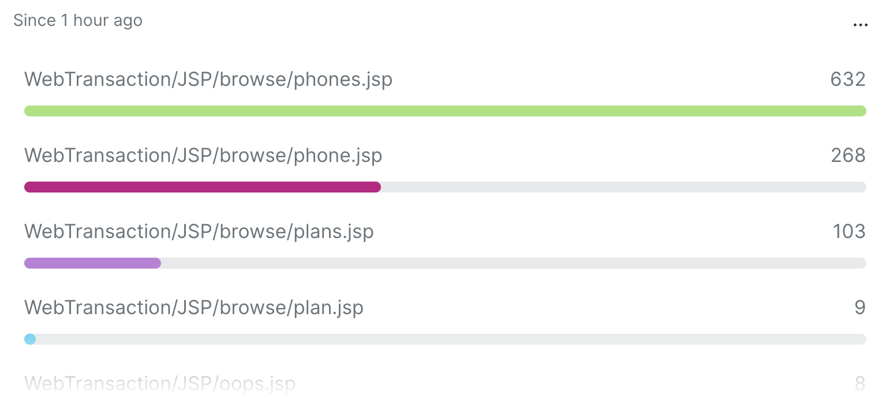
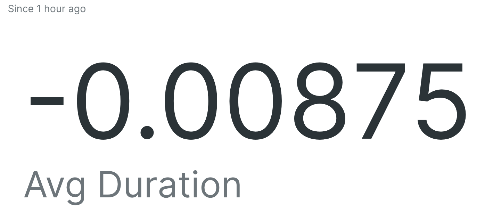
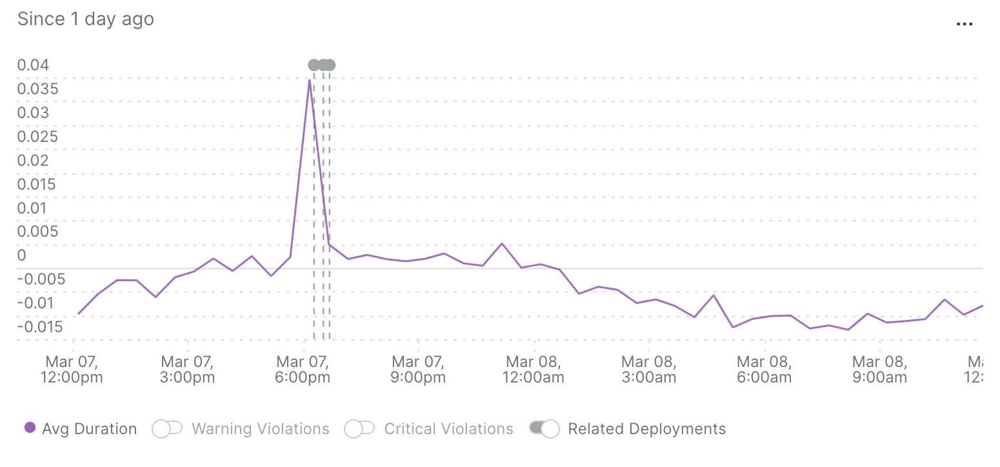

# Lab 03: Connecting data from different sources
In this lab you will learn to use **sub queries** to connect data from multiple different sources and time ranges within a single query

## Pre-requisites
To complete this lab you need access to the Demotron v2 account in New Relic. This can be accessed via your NRU learning account.

## Dynamically generated filters
When querying data you may sometimes wish to filter that data by some threshold. Consider this simple query that counts the number of transactions that are taking longer than a threshold of 0.5 seconds:

```
SELECT count(*) from Transaction where appName='WebPortal' AND duration > 0.5
```

What if we wanted to count the number of transactions that took longer than average? One way would be to calculate the average, then update our query:

```
SELECT average(duration) FROM Transaction WHERE appName='WebPortal'
=> 0.0577   -----------------------------------------------------------------
                                                                            |
                                                                            V
SELECT count(*) FROM Transaction WHERE appName='WebPortal' AND duration > 0.0577
```

Whilst this works it needs updating manually each time the average changes. The NRQL sub query feature allows us to derive this value with a sub query. To use a sub query is straightforward, simply replace the value you are testing against with a bracketed query:

```
SELECT ... FROM ... WHERE column > (SELECT...)
```

For out example above we can combine both the above queries as follows:
```
SELECT count(*) from Transaction where appName='WebPortal' AND duration > (SELECT average(duration) FROM Transaction where appName='WebPortal')
```

### ✏️ Challenge #1
Counting the number of transactions taking above *average* time to respond *may* be useful, but possibly a more useful filter would be to find outliers. One way you could do this is to filter to all the transactions taking longer than, say, the 99th percentile.

Update the query so that it counts the number of outlier transactions above the 99th percentile.

```
SELECT count(*) from Transaction where appName='WebPortal' AND duration > (SELECT ____ FROM Transaction where appName='WebPortal')
```

> Hint: You will need to use the [`percentile()`](https://docs.newrelic.com/docs/query-your-data/nrql-new-relic-query-language/get-started/nrql-syntax-clauses-functions/#func-percentile) function.

[[-Solution-]](./solution.md#challenge-1)

### ✏️ Challenge #2
Knowing how many transactions are in the 99th percentile is one thing, but wouldn't it be useful to know which transactions were responsible? 

Adjust your query so that it generates a table chart displaying all the unique transaction names, along with transaction count, for all transactions that have a duration above the 99th percentile. Which transactions are the primary culprits?

> Hint: Faceting transaction data by the `name` attribute will return a result for each unique transaction name.

It should look a bit like this:


[[-Solution-]](./solution.md#challenge-2)

### ✏️ Challenge #3
Our current query 99th percentile is calculated against the same time window as our outer query, 1 hour. Perhaps it would make more sense to calculate the percentile over a longer time frame? Sub queries can have their own `SINCE` clause and query over different time periods.

Adjust your answer to Challenge #2 so that the 99th percentile is calculated over the entire last week of data.

[[-Solution-]](./solution.md#challenge-3)

### ✏️ Challenge #4
We now know which transactions suffer the most from slow response times above the 99th percentile, but how bad are they?

Write a new query based upon the answer to Challenge #3 that shows the average transaction *duration* for those transactions that are breaching the 99th percentile.

> Hint: Previously you were calculating the count of transactions, for this challenge we need the average duration.

[[-Solution-]](./solution.md#challenge-4)


## Dynamically derived values
Not only can we use sub queries for filtering our data we can also use it to calculate new derived values within the `SELECT` clause. Taking our previous example, what if we wanted to know the difference, i.e. delta, between now and the average for the entire week? 

We can do this by putting a sub query into the SELECT and treating it just like any other value:

```
SELECT average(duration)-({result from sub query}) AS 'Delta' ...
```

Let's see this in action:
```
SELECT average(duration)-(SELECT average(duration) AS 'Delta' FROM Transaction WHERE appName='WebPortal' SINCE 1 week ago) FROM Transaction WHERE appName='WebPortal' SINCE 1 hour ago
```


In this query above we are able to calculate the delta between the current average duration and that for the whole week. Notice how the sub query has its own `SINCE` clause to ensure we're comparing with the weekly average.

> Note: The since clause of the inner query will be affected by the time picker on a dashboard. Set **ignore time picker** for any charts where the sub query time window should not be affected by the time picker.

### ✏️ Challenge #5
It might be interesting to see how the transactions response times are changing over time compared to the weekly average. 

Update the query below to show variation from the average over the last day.

What happens if you use percentiles instead?

```
SELECT average(duration)-(SELECT average(duration) AS 'Delta' FROM Transaction WHERE appName='WebPortal' SINCE 1 week ago) FROM Transaction WHERE appName='WebPortal' SINCE 1 hour ago
```

> Hint: Use `TIMESERIES` to view data over time

The output should look something like this:


[[-Solution-]](./solution.md#challenge-5)

## Sub query variables
You may have a requirement to use a sub query multiple times in your NRQL. Rather than repeat it multiple times you can define it as a variable and then use it multiple times. This can significantly simplify your query whilst at the same time ensure you are not querying more data than you need to.

Let's revisit the delta query from before. As well as displaying the delta it might be useful to show the current average and the weekly average all together:

```
SELECT 
 average(duration) as 'Current Average',
 (SELECT average(duration) AS 'Delta' FROM Transaction WHERE appName='WebPortal' SINCE 1 week ago) as 'WeeklyAverage',
 average(duration)-(SELECT average(duration) AS 'Delta' FROM Transaction WHERE appName='WebPortal' SINCE 1 week ago) as 'Delta'
FROM Transaction WHERE appName='WebPortal' SINCE 1 hour ago
```

You can see the sub query appears twice. Let's rewrite this using the `WITH...AS` clause to simplify:
```
WITH (SELECT average(duration) AS 'Delta' FROM Transaction WHERE appName='WebPortal' SINCE 1 week ago) as wkAvg 
SELECT 
 average(duration) as 'Current Average',
 wkAvg as 'WeeklyAverage',
 average(duration)-wkAvg as 'Delta'
FROM Transaction WHERE appName='WebPortal' SINCE 1 hour ago
```

If you use the same sub query more than once move it to a variable. You may consider doing this anyway to aid readability.

> Note: When specifying as a variable dont place any quotes around the variable name after the `AS`

## Connecting data sets to surface more insight
Up until now we've been using sub queries to filter and derive data based upon aggregate functions across the same data set. What if we wanted to combine *different* sets of data to gain more insight into our data?

Consider an online shopping site. On the whole customers browse the shop and, hopefully, end up paying. How useful might it be to perform some funnel anlaysis on what pages people visit (or don't visit) before paying? Sub queries empower us to answer just these sorts of questions.

If we browse the PageView data in Demotron we can see that there is a purchase confirmation page `confirmation.jsp`. For all the customers on our site that make a purchase, what pages do they visit?

First, we need to get a list of all the customer browser sessions that made it to our confirmation page:

```
SELECT uniques(session,1000) FROM PageView WHERE appName='WebPortal' AND name LIKE '%/confirmation.jsp' LIMIT MAX
```

We then use this as a sub query with the `WHERE x IN (..)` clause to restrict our results to only those sessions that visited the confirmation page:

```
SELECT count(*) FROM PageView WHERE session IN (SELECT uniques(session,1000) FROM PageView WHERE appName='WebPortal' AND name LIKE '%/confirmation.jsp' LIMIT MAX) FACET name
```

This returns a list of all the pages that are visited by customers that confirmed payment.

### ✏️ Challenge #6
Our customer service team would like to know, in the last day, how many customers that confirmed payment also viewed the contact page ('contact.jsp').

Amend the query so that it looks over the last day of data and returns just the number of customers that paid *and* visited the contact page.

```
SELECT count(*) FROM PageView WHERE session IN (SELECT uniques(session,1000) FROM PageView WHERE appName='WebPortal' AND name LIKE '%/confirmation.jsp' LIMIT MAX) FACET name
```
> Hint: A `LIKE` filter pattern for the contact page is `'%contact.jsp'`

> Hint: You need to look over the entire day to get some results

> Hint: A customer is synonymous to a `session`


## Connecting data from different sources
Its possible to source the data for you sub query from another event type entirely. For example say you are interested in viewing the logs for slow spans in your distributed trace you could construct a query that gathers all the logs for traces that contain those slow spans like this:

```
FROM Log SELECT trace.id,message, span.id  WHERE trace.id IN (
    FROM Span SELECT latest(trace.id) WHERE duration > (
        FROM Span SELECT percentile(duration, 99) WHERE appName='WebPortal' 
    ) FACET trace.id ORDER BY average(duration) WHERE appName='WebPortal' LIMIT 100
) LIMIT max
```


## Conclusion
You have learnt how to use sub queries to filter and derive values as well as use them to connect data from sources. This feature of NRQL can help make your queries more dynamic and reduce the amount of hard coding or manual updates.

Read more about connecting data with sub queries in this [blog post](https://newrelic.com/blog/how-to-relic/nrql-subqueries).